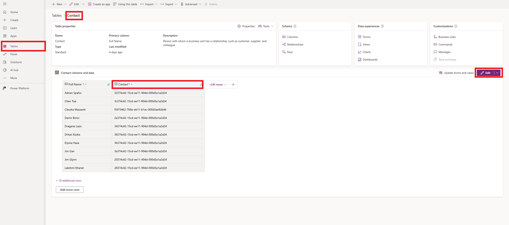
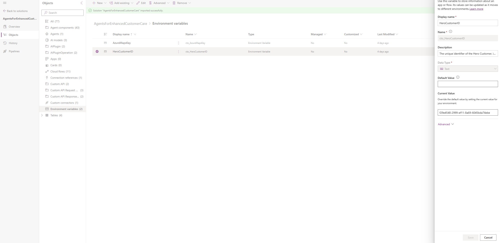

# Pre Requisites

1. Power Platform environment with System Administrator, Omnichannel agent and Omnichannel admin access.
2. The Power Platform environment would already have Dynamics 365 Contact Center (formerly called Omnichannel) deployed.
3. Dynamics 365 Contact Center (Digital + Voice) license
4. Dynamics 365 Customer Service Enterprise license
5. Ensure this appsource app is installed in the Power Platform environment [Business Apps](https://appsource.microsoft.com/en-us/product/dynamics-365/mscrm.omnichannelpvaextension?tab=Overview).
6. Copilot Studio license
7. AI prompts (formerly called AI builder) credits
8. Azure portal access and ability to create Key Vault & Azure Maps resources.
9. Download AgentsForEnhancedCustomerCare zip file from Solution folder.

# Deployment Guide

This document will comprise of step by step instructions on how to deploy this solution. At a very high level, it has 2 major setups involved.

1. Copilot Agent Setup
2. Dynamics 365 Customer Service and Contact Center setup

# Step 1: Copilot Agent Setup

## Step 1.1 Import the Zip solution

1. The zip file in the solutions folder contains all the components needed for provisioning the AI agent.
2. Import the zip file in the [PowerApps Maker Portal](https://make.powerapps.com) in the power platform environment provisioned earlier.
3. During import, **leave the 2 environment variables blank for now.**
4. After importing has completed, click **Publish all customizations**, and wait for publishing to complete.

## Step 1.2 Validate channel setup in Copilot Studio

1. After the zip solution import, go to [Copilot Studio Portal](https://copilotstudio.microsoft.com) and select the Power Platform environment from the top right where the solution has been imported. You may need to refresh the page as it takes a few minutes for the copilot to reflect post zip file import.
2. Open the **Voice Agent for Telco copilot agent.**
3. On the channels tab, click on Dynamics 365 Customer service. If the agent is connected to Dynamics 365 already, **please disconnect it and reconnect it** as that will confirm the agent will respond to Dynamics 365.  More details on the same can be found [Here.](https://learn.microsoft.com/en-us/microsoft-copilot-studio/configuration-hand-off-omnichannel?tabs=webApp)

## Step 1.3 Sample Data Import

1. In the Data Folder, we will need to import sample data for 4 tables.
2. Download the 4 excel files from the folder.
3. The order of import here is important. **We will need to import Contacts first followed by cases, KB articles and cell data usage**.
   * Note that it is recommended to **Allow Duplicates**, in case the sample data triggers any duplicate rule configurations for your existing data.
4. Go to [PowerApps Maker Portal](https://make.powerapps.com) and click on Apps.
5. In the **'All'** section, click Play on **Customer Service Workspace.**
6. Click on the ellipsis on the top left (it looks like 3 horizontal lines) and select Contacts.
7. Click on the ellipsis near the top right (it looks like 3 vertical dots) and select import from excel.
8. Choose the contacts sample data file and hit Next.
9. Click Finish import.
10. You can optionally click 'Track Progress' to see the stauts of the import.
11. Repeat steps 6-10 for **Cases.**
12. Repeat steps 6-10 for **Knowledge Base articles.** Post import of the 2 Knowledge Base articles, **open the records in the Customer Service Workspace app and 'Publish' them.**
13. For the last table **Cell Data Usage,** in Customer Service workspace app from Step 1.3.5, click on the settings icon from the top right.
14. Click Advanced Settings> Data Management> Imports.
15. Click '+ Import Data' from the top menu and choose the Cell data Usage file.
16. This step may be needed depending on your version of the app. Click Next> Click on Enity Mapping dropdown and select 'Cell Data Usage' table.
17. This step may be needed depending on your version of the app. Click Next and Click Finish. If there is a warning about unmapped fields, please ignore it.

## Step 1.4 Enable Dataverse search (a.k.a. Relevance search)

1. In the [Power Platform Admin portal](https://admin.powerapps.com/), navigate to the Environment that you imported the solution file into.
2. Navigate to **Settings** > **Product** > **Features**
3. Find the **Dataverse search** toggle, and ensure it is turned **ON.**
4. Ensure you click the **Save** button.

## Step 1.5 Set HeroCustomer environment variable and Mobile Phone Number

1. To set the HeroCustomer environment variable, we will need the **GUID value of the Contact**. From the sample Contact import in Step 1.3, that is Nicole Swanson but please feel free to use a different Contact as desired.
2. For finding the GUID value, go to [PowerApps Maker Portal](https://make.powerapps.com) > Click on Tables> Contacts
3. In the Contact table, make sure you can see the **Full Name, Mobile Phone and Contact fields** in the table view. If you cannot see the Mobile Phone & Contact field, please add it by clicking 'Edit' on the right.
4. Update the **Mobile Phone field to the phone number you plan to use to make the phone call as a customer** when demoing this solution in the format +14251234567.
5. You will see a list of all Contacts with one of them being "Nicole Swanson" imported from Step 1.3. Copy the GUID value for the contact.
6. 
7. From here go to Solutions> Open the Agents for Enhanced Customer Care solution.
8. Click on **Environment Variables** and select HeroCustomerID.
9. Enter the GUID value from step 1.4.4 and click **'Save'** as shown below.
10. 

## Step 1.6 Host Sample Response Data and Update Custom Connector

The Custom Connector leveraged by the connector plugin can be demonstrated with a simulated API response. Follow these instructions to configure the simulated response, or create your own custom connector as needed.

1. Host the sample data found in the [customconnector_sampleresponse.json](./Data/customconnector_sampleresponse.json) file in a location of your choosing. For demonstration purposes, this can be a publicly available location, such as in Azure Blob Storage, in a Power Pages page, or an alternate web server location.

* If, for testing or demonstration purposes, you choose to host the sample response payload in a Power Pages page, you will need:
  * A publicly-accessible Power Pages portal that you are able to manage via the [Dynamics 365 Portal Management app}(https://learn.microsoft.com/en-us/power-pages/configure/portal-management-app)
* You can create a Web Template that contains the simulated response content:
  * 
* You can use that Web Template in a Page Template:
  * 
* You can use that Web Template in a Page Template:
  * 
  * and the URL for the Web Page can be used in subsequent steps

2. Retrieve the URL where the sample response is hosted.
3. In the Power Apps Maker portal, navigate to the **AgentsForEnhancedCustomerCare** solution, and navigate to **Custom connectors**
4. Click on **Provision Product for Customer**, to open the connector
5. After the Power Automate portal opens the connector, click the **Edit** button
6. In the **General** tab, update the **Host** and **Base URL** values to match the hosting location of your sample response content.
7. Click **Update Connector**
8. Back in the Power Automate Maker portal, navigate to the Overview page of your **AgentsForEnhancedCustomerCare** solution, and click **Publish all customizations**

## Step 1.7 Connector Plugin and Prompt Plugins setup

1. After the zip file is imported from step 1.1, the solution includes AI Plugins and Prompt Plugins that need to be enabled in order for the solution to work.
2. Go to [PowerApps Maker Portal](https://make.powerapps.com) and click on Apps.
3. In the **'All'** section, click Play for **Customer Service Admin Center.**
4. Go to **Productivity> Plugins for generative AI**
5. You will see **'Provision Product for Customer' and 'Cell Data Usage Summary'** plugins that are turned off.
6. Click on the round circle to the left and select 'Provision Product for Customer'.
7. Click **'Turn On'** from the top of the screen.
8. Click user authentication to be 'Admin'. You may elect to use the 'Agent' option if it better suits your future needs. Click **Next.**
9. Let access type remain '**All agents who have Copilot**'
10. Check the first checkbox below the Plugin & Description sections.
11. Make sure the 'Don't summarize plugin responses' checkbox is **unchecked.**
12. Click **Next > Click Turn On Plugin.**
13. You will be prompted to publish changes. Click the **'Publish changes' button > Confirm.**
14. This process will take a few minutes. Once it's done, **repeat steps 6-12 for 'Cell data Usage Summary' plugin.**

## Step 1.8 Obtain Azure Maps Key

1. Select **Create a resource** in the upper left-hand corner of the [Azure portal](https://portal.azure.com).
2. Type **Azure Maps** in the Search services and Marketplace box.
3. Select **Azure Maps** in the drop-down list that appears, then select the **Create** button.
4. On the **Create an Azure Maps Account** resource page, enter the following values then select the **Create** button:
   * The *Subscription* that you want to use for this account.
   * The *Resource group* name for this account. You may choose to *Create new* or *Select existing* resource group.
   * The *Name* of your new Azure Maps account.
   * The *Pricing tier* for this account. Select **Gen2**.
   * Read the *License and Privacy Statement*, then select the checkbox to accept the terms.
     * 
5. Open your Maps account resource in the Azure portal.
6. In the settings section, select **Authentication**.
7. Copy the **Primary Key** and save it locally to use later in this setup.

## Step 1.9 Configure Azure Key Vault Secret

This solution will need Azure Key Vault for storing the key needed to consume Azure Maps. Additional background can be found in documentation [here](https://learn.microsoft.com/en-us/power-apps/maker/data-platform/environmentvariables-azure-key-vault-secrets).

1. Register the **Microsoft.PowerPlatform** resource provider in your Azure subscription. Follow these steps to verify and configure: [Resource providers and resource types](https://learn.microsoft.com/en-us/azure/azure-resource-manager/management/resource-providers-and-types)
2. From the Azure portal menu, or from the **Home page**, select **Create a resource**.
3. In the Search box, enter Key Vault.
4. From the results list, choose Key Vault.
5. On the Key Vault section, choose Create.
6. On the Create key vault section provide the following information:
   * **Name**: A unique name is required.
   * **Subscription**: Choose a subscription.
   * Under **Resource Group**, choose **Create new** and enter a resource group name.
   * In the **Location** pull-down menu, choose a location.
   * Leave the other options to their defaults.
7. Select **Create**.
8. Take note of these two properties:
   * **Vault Name**: In the example below, this is Contoso-Vault2. You'll use this name for other steps.
   * **Vault URI**: In the example below, the Vault URI is https://contoso-vault2.vault.azure.net/. Applications that use your vault through its REST API must use this URI.
   * 
9. You will need an Azure role that allows you to create secrets in your Key Vault. Ensure your user has a role such as **Key Vault Secrets Officer**, to enable you to create a secret. If you require assistance with this step, please refer to the documentation found [here](https://learn.microsoft.com/en-us/azure/key-vault/general/rbac-guide?tabs=azure-cli).
10. On the Key Vault left-hand sidebar, select **Objects** then select **Secrets**
11. Select **+ Generate/Import**.
12. On the **Create a secret** screen choose the following values:

* **Upload options**: Manual.
* **Name**: Enter **AzureMapsKey**
* **Value**: Paste in the value of the Azure Maps key you obtained earlier. Key Vault APIs accept and return secret values as strings.
* **Tags**: Leave this blank for the time being, but note that we will return here to add a Tag at a future step.
* Leave the other values to their defaults. Select **Create**.

13. After creation is complete, you should see your newly-created secret listed. Select the name of your secret that you just created, to view the details for the secret.
14. In the left navigation, select **Access control (IAM)** for the secret
15. Select **Add** > **Add role assignment**
16. Search for the **Key Vault Secrets User** role, and click **Next**
17. With **User, group, or service principal** selected, choose **+ Select members**, then search for and choose both **Dataverse** and **Power Virtual Agents Service** applications, as well as your user that you will use to access the **Power Apps Maker portal** in the next steps.
18. Choose **Review and Assign** to complete adding the role assignments.

# Step 1.10 Update AzureMapsKey Environment Variable

1. In the Power Apps Maker portal, navigate to the **AgentsForEnhancedCustomerCare** solution, and navigate to **Environment variables**
2. Click the **AzureMapsKey** environment variable to edit the values
3. Under **New Azure Key Vault secret reference**, populate the following values:
   * **Azure Subscription Id**: This can be retrieved from the Azure portal, when viewing your Subscription overview
   * **Resource Group Name**: This is the name of the resource group that you created your Key Vault in
   * **Azure Key Vault Name**: This is the name of the Key Vault resource you created in the Azure portal
   * **Secret Name**: This is **AzureMapsKey** (correlating to the name of the secret created in the Key Vault)
4. Click **Save**
5. Publish your changes, by navigating to the Overview page for your solution in the left navigation, then clicking **Publish all customizations**.

# Step 1.11 Grant Secret Access to your Agent

1. In Copilot Studio, open your **Voice Agent for Telco** agent.
2. In the **Test your agent** panel, when greeted by the agent, start following the demo script, until you reach an error message, as shown below.
   * 
3. Copy the value of **{envId}/{schemaName}** included in the error message to your clipboard.
4. In the Azure portal, navigate back to your AzureMapsKey secret, click on the **Current Version**, and click on **Tags**
5. Add a new Tag, with the Tag Name **AllowedBots**, and the Tag Value pasted from your clipboard.
6. Click **Apply**, to save your changes.

# Step 1.12 Publish Copilot Agent

1. Go to [Copilot Studio Portal](https://copilotstudio.microsoft.com). Please Publish your Copilot Agent by clicking 'Publish'. This will make the copilot agent ready to be used. If there is a warning around no authentication that's expected per the use case.
2. Make sure this bot is added to the workspace that will be created subsequently in Step 2.4.

# Step 2: Dynamics 365 Contact Center Configuration

Dynamics 365 Conctact Center is leveraged in this solution for customers to be able to speak with AI agents & human agents through a voice channel. This involves setup of various parts of the application outlined below.

## Step 2.1 Enable & manage Users

Users need to be added & configured in Dynamics 365 Contact Center so that calls can be routed to them when needed. This involves setup of details like Skills, Queues and Capacity profiles to name a few.

1. Details about Contact Center User setup can be found [Here](https://learn.microsoft.com/en-us/dynamics365/customer-service/administer/users-user-profiles).

## Step 2.2 Create & manage Queues

Queues are leveraged in Dynamics 365 Contact Center to route items to the appropriate agent based on various factors like capacity, skillset, working hours and the type of item. In this solution, since a Voice channel is being leveraged, we will need a Queue of type voice with the users from step 1.1 added to it.

1. Details about Contact Center Queue setup can be found [Here](https://learn.microsoft.com/en-us/dynamics365/customer-service/administer/queues-omnichannel).

## Step 2.3 Setup Agents/Bots

Once the Users and Queues are setup, the next step would be to setup an Agent and connect it to Dynamics Contact Center. AI Agents are used to enhance Customer experience & satisfaction along with increasing the efficiency of human agents by performing various tasks & answering questions.

1. Creation of agents and connecting the agent to Dynamics contact center can be found [Here](https://learn.microsoft.com/en-us/dynamics365/customer-service/administer/manage-your-bots). Since this agent will be using voice capabilities, checking the box in the lower left to enable voice should be done.

## Step 2.4 Setup Voice Channel & Workstream

Once the Users and Queues are setup, the next step would be to setup a channel in Dynamics Contact Center. Channels are used to configure different ways a customer can reach out to an agent like Voice, chat, SMS, Microsoft Teams, Social media etc. In this solution, we are using a voice channel which means we will need to setup a phone number in order to be able to recieve calls from customers. Workstreams are leveraged as a container to enrich, route & assign work items to agents. Workstreams are associated to channels.

1. Voice channel and workstream setup can be found [Here](https://www.youtube.com/watch?v=dZpvjbtLras).
2. *OPTIONAL: The chat channel setup can be found [Here](https://learn.microsoft.com/en-us/dynamics365/customer-service/administer/add-chat-widget). If you would like to create this solution with a chat interface rather than a voice channel, leverage this step.*
3. Once the workstream is created, add the bot created in step 2.3 to the bot section of the workstream.

## Step 2.5 Enable Copilot features

Copilot features are leveraged in Dynamics 365 Contact Center to enhance human Agent productivity by summarizing messages, drafting emails and triggering plugins to name a few. In Customer Service Admin Center, navigate to Productivity in Agent Experience. The 3 sections that need to be enabled are summarization of the actual conversation, summarization of the Timeline, and Plugins, and email drafting enabled as these features are leveraged in this solution.

1. How to enable various copilot features can be found [Here](https://learn.microsoft.com/en-us/dynamics365/customer-service/administer/copilot-enable-help-pane#enable-ask-a-question).

## Step 2.6 Notification Templates

Notification templates are leveraged to modify the information a Human Agent sees when a conversation comes over to them in Dynamics 365 Contact Center. In this solution, we have leveraged this functionality to modify the out of the box notification template to show relevant information for the human agent.

1. Information on how notification templates are modified can be found [Here](https://learn.microsoft.com/en-us/dynamics365/customer-service/administer/notification-templates).

## Step 2.7 Edit forms in Dynamics 365

Dynamics 365 forms are leveraged to show data to the human agent when they are interacting with the customer. In this solution, forms have been customized to show the most relevant data an agent can leverage about the customer they are talking too.

1. Information on how forms are modified can be found [Here](https://learn.microsoft.com/en-us/dynamics365/customerengagement/on-premises/customize/create-design-forms?view=op-9-1).

## Step 2.8 Dataverse search

Dataverse search in Dynamics 365 is used to search for records in tables. One of the power automate worflows in this solution leverages this functionality.

1. Information on how to configure Dataverse search can be found [Here](https://learn.microsoft.com/en-us/power-platform/admin/configure-relevance-search-organization).

## Step 2.9 Create Knowledge Base Article

Knowledge base articles in Dynamics 365 are leveraged to give relevant information to human agents about Products, Services or help them with troubleshooting as well. In this solution, a sampleknowledge base article is leveraged to provide the needed information to the human agent when they are talking to the customer. **The HTML code of these knowledge base articles has been attached in the data folder of this repo.**

1. Navigate to Customer Service or Customer Service Workspace
2. Click on Knowledge Articles > New
3. Enter the data as shown below for the different fields:
   **Title**: Contoso Mesh 1500 Product Compatibility
   **Description**: An overview of device compatibility for the Contoso Mesh 1500 product, including a list of routers and gateways that it will function with.
   **Keywords**: Contoso Mesh 1500, compatibility, works with, gateway
   **Content**:

**Contoso Mesh 1500 Compatibility Overview**

The Contoso Mesh 1500 product allows customers to improve their home internet experience by eliminating dead zones, scaling network access, and increasing the number of devices that can connect via Wifi.

Router products that are compatible with the Contoso Mesh 1500 product include:

* Contoso 5G Home Internet 1000 Gateway
* Contoso 5G Home Internet 500 Gateway
* Contoso Router 300 Home
* Contoso Router 500 Business
* Contoso Wi-Fi 200

See our other articles about steps to install the Contoso Mesh 1500 with any of these supported gateways and routers.

4. Save & Publish
