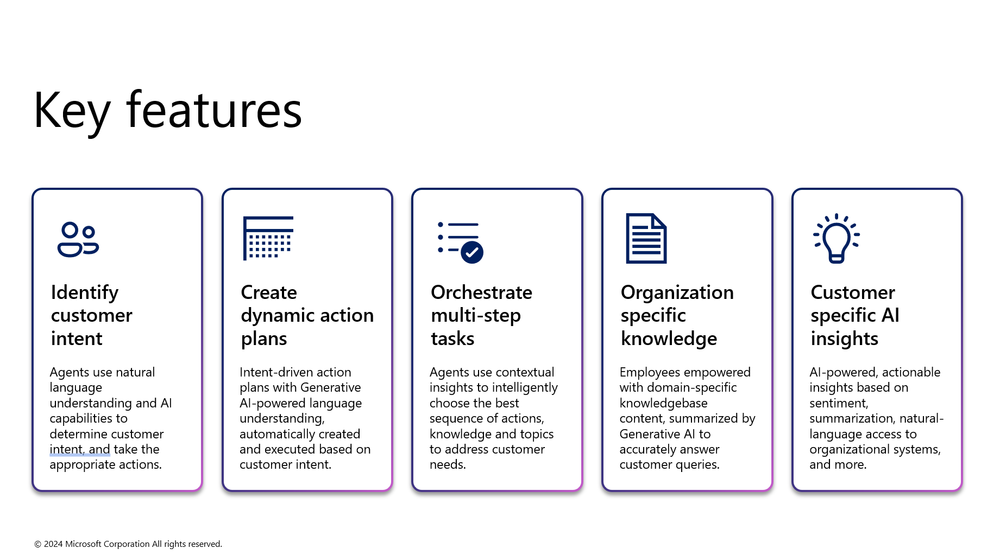
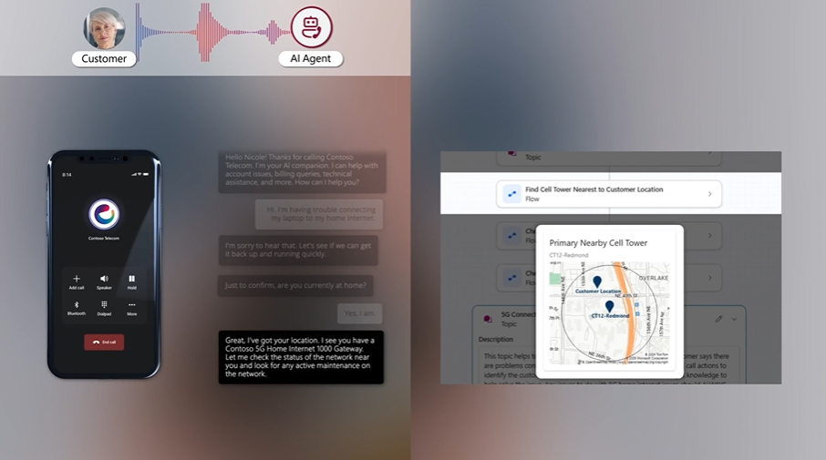
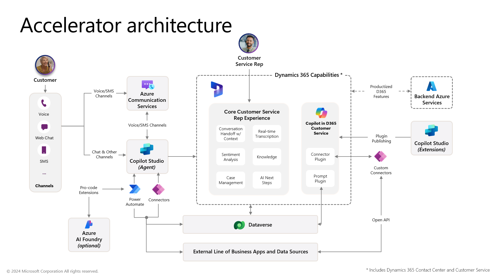

# Agents for Enhanced Customer Care

MENU: [**USER STORY**](#user-story) \| [**QUICK DEPLOY**](#quick-deploy) \| [**SUPPORTING DOCUMENTS**](#supporting-documents)

## User Story

### Solution Overview

The Agents for Enhanced Customer Care solution accelerator leverages agents in the context of customer engagement, to provide delightful customer experiences, and empower agents in the contact center, in the context of a Telecommunications organization. Agent AI capabilities are used to engage directly with customers on the voice/phone channel, as well as to provide contextual and organization-specific insights to contact center employees. This results in increased customer satisfaction, cost reduction and increased revenue for targeted business impact.

The solution accelerator leverages Dynamics 365 Contact Center, Copilot Studio, Copilot in Dynamics 365 Customer Service, and Power Platform as the core components for the solution.

Customers of the organization are able to speak with an AI-powered agent on the voice channel as the first point of interaction. The AI agent understands customer intent and dynamically formulates and executes a plan of action, using Generative AI-based orchestration to assemble the appropriate knowledge, topics, and actions to drive to resolution. When necessary, troubleshooting steps can be dynamically prepared, and stepped through with the customer, personalized to the customer's technical aptitude. If needed, the AI agent seamlessly escalates the conversation to a human customer service representative, where Copilot in Dynamics 365 Customer Service is leveraged to enhance the employee's productivity by giving them intelligently-summarized information about the customer and their conversation with the AI agent, their past interaction history, and natural-language access to organization-specific data and applications. This results in higher agent productivity, and higher customer satisfaction, by reducing the time it takes to resolve the customer call, and increasing the accuracy of the service representative.

**NOTE:** This accelerator is not intended to be a production ready solution. The components can be extended through customization & configuration as desired to create a production ready solution. All components packaged have been done through a unmanaged solution which allows users to be able to customize & extend the components post deployment.

### Key features

This accelerator focuses on harnessing the following key capabilities:

* [GenAI-based planning and orchestration](https://learn.microsoft.com/en-us/microsoft-copilot-studio/advanced-generative-actions) in Copilot Studio
* Dynamic and contextual troubleshooting in Copilot Studio
* Extending Copilot in Dynamics 365 Customer Service to be industry- and organization-specific through [Prompt Plugins and Connector Plugins](https://learn.microsoft.com/en-us/dynamics365/customer-service/administer/enable-copilot-plugins-for-generative-ai)

Additional details on how these capabilities are leveraged in this accelerator can be found here:

* [GenAI-based Orchestration of Topics and Actions in Copilot Studio](./Deployment/Differentiators/DIFFERENTIATORS.md#genai_orchestration)
* [Dynamically-generated Adaptive Cards in Topics and Actions](./Deployment/Differentiators/DIFFERENTIATORS.md#adaptive_cards)
* [Dynamically-generated Azure Maps Images in Adaptive Cards](./Deployment/Differentiators/DIFFERENTIATORS.md#azure_maps)
* [Dynamically-generated Troubleshooting Steps in Copilot Studio Topics](./Deployment/Differentiators/DIFFERENTIATORS.md#troubleshooting_steps)
* [Prompt Plugins for Copilot in D365 Customer Service](./Deployment/Differentiators/DIFFERENTIATORS.md#prompt_plugins)
* [Connector Plugins for Copilot in D365 Customer Service](./Deployment/Differentiators/DIFFERENTIATORS.md#connector_plugins)

Below is an image of the solution accelerator.

### Scenario

A customer calls the customer support number of their telecommunications service provider to try to resolve an ongoing 5G home internet connectivity issue, and receives a personalized greeting by an AI agent. The customer describes the home internet connectivity issue, and the agent is able to intelligently understand the customer's intent. The AI agent intelligently and dynamically creates an action plan to investigate and resolve the issue. A series of actions are intelligently assembled, to determine if there is a network issue at the customer's network node. Upon identifying that the network is operating as expected, the agent assembles and walks through a set of troubleshooting steps to help identify and resolve the problem on the customer's end. Upon resolution, the AI agent identifies an upsell opportunity that will prevent the issue from impacting the customer in the future, and asks the customer if they would be interested.

Once the customer confirms interest and agrees to speak with a representative, the AI agent transfers the conversation to a contact center employee who receives a Copilot-provided summary of the conversation between the customer & the AI agent, empowering him to best assist the customer. From there, the representative is empowered with organization-specific insights from Copilot, enabling him to use natural language to retrieve data usage history, provision products and services, and take other actions in industry-specific line-of-business applications.

The call is wrapped up with an intelligently-drafted email sent to the customer that summarizes the interaction between the customer, AI agent and representative.

## Quick Deploy

Please click this [**Link to Deployment Guide**](Deployment/README.md) for instructions on how to deploy and set up the solution accelerator.

[**Usage Guidance**](Deployment/Data/USAGE_GUIDANCE.md) has been provided to assist you in executing the steps required to see the included capabilities of this accelerator in action.

### Solution Accelerator Architecture

## Supporting Documents

### How to customize

This solution is designed to be easily customizable. All configuration and customizations to this solution will be done in Dynamics 365, Power Platform and Copilot Studio.

### Additional resources

1. [Microsoft Power Platform](https://learn.microsoft.com/en-us/power-platform/)
2. [Microsoft Copilot Studio](https://learn.microsoft.com/en-us/microsoft-copilot-studio/)
3. [Dynamics 365 Contact Center ](https://learn.microsoft.com/en-us/dynamics365/contact-center/)

## Disclaimers

This release only supports English language input and output. Users should not attempt to use the system with any other language or format. The system output may not be compatible with any translation tools or services, and may lose its meaning or coherence if translated.

This release does not reflect the opinions, views, or values of Microsoft Corporation or any of its affiliates, subsidiaries, or partners. The system output is solely based on the system's own logic and algorithms, and does not represent any endorsement, recommendation, or advice from Microsoft or any other entity. Microsoft disclaims any liability or responsibility for any damages, losses, or harms arising from the use of this release or its output by any user or third party.

This release is intended as a proof of concept only, and is not a finished or polished product. It is not intended for commercial use or distribution, and is subject to change or discontinuation without notice. Any planned deployment of this release or its output should include comprehensive testing and evaluation to ensure it is fit for purpose and meets the user's requirements and expectations. Microsoft does not guarantee the quality, performance, reliability, or availability of this release or its output, and does not provide any warranty or support for it.

This Software requires the use of third-party components which are governed by separate proprietary or open-source licenses as identified below, and you must comply with the terms of each applicable license in order to use the Software. You acknowledge and agree that this license does not grant you a license or other right to use any such third-party proprietary or open-source components.

To the extent that the Software includes components or code used in or derived from Microsoft products or services, including without limitation Microsoft Azure Services (collectively, “Microsoft Products and Services”), you must also comply with the Product Terms applicable to such Microsoft Products and Services. You acknowledge and agree that the license governing the Software does not grant you a license or other right to use Microsoft Products and Services. Nothing in the license or this ReadMe file will serve to supersede, amend, terminate or modify any terms in the Product Terms for any Microsoft Products and Services.

You must also comply with all domestic and international export laws and regulations that apply to the Software, which include restrictions on destinations, end users, and end use. For further information on export restrictions, visit [https://aka.ms/exporting](https://aka.ms/exporting).

You acknowledge that the Software and Microsoft Products and Services (1) are not designed, intended or made available as a medical device(s), and (2) are not designed or intended to be a substitute for professional medical advice, diagnosis, treatment, or judgment and should not be used to replace or as a substitute for professional medical advice, diagnosis, treatment, or judgment. Customer is solely responsible for displaying and/or obtaining appropriate consents, warnings, disclaimers, and acknowledgements to end users of Customer’s implementation of the Online Services.

You acknowledge the Software is not subject to SOC 1 and SOC 2 compliance audits. No Microsoft technology, nor any of its component technologies, including the Software, is intended or made available as a substitute for the professional advice, opinion, or judgement of a certified financial services professional. Do not use the Software to replace, substitute, or provide professional financial advice or judgment.

BY ACCESSING OR USING THE SOFTWARE, YOU ACKNOWLEDGE THAT THE SOFTWARE IS NOT DESIGNED OR INTENDED TO SUPPORT ANY USE IN WHICH A SERVICE INTERRUPTION, DEFECT, ERROR, OR OTHER FAILURE OF THE SOFTWARE COULD RESULT IN THE DEATH OR SERIOUS BODILY INJURY OF ANY PERSON OR IN PHYSICAL OR ENVIRONMENTAL DAMAGE (COLLECTIVELY, “HIGH-RISK USE”), AND THAT YOU WILL ENSURE THAT, IN THE EVENT OF ANY INTERRUPTION, DEFECT, ERROR, OR OTHER FAILURE OF THE SOFTWARE, THE SAFETY OF PEOPLE, PROPERTY, AND THE ENVIRONMENT ARE NOT REDUCED BELOW A LEVEL THAT IS REASONABLY, APPROPRIATE, AND LEGAL, WHETHER IN GENERAL OR IN A SPECIFIC INDUSTRY. BY ACCESSING THE SOFTWARE, YOU FURTHER ACKNOWLEDGE THAT YOUR HIGH-RISK USE OF THE SOFTWARE IS AT YOUR OWN RISK.
